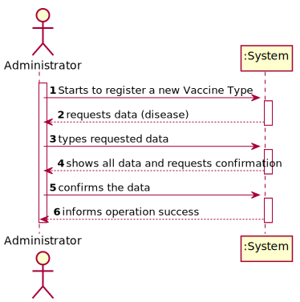
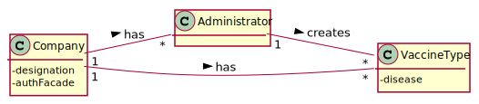
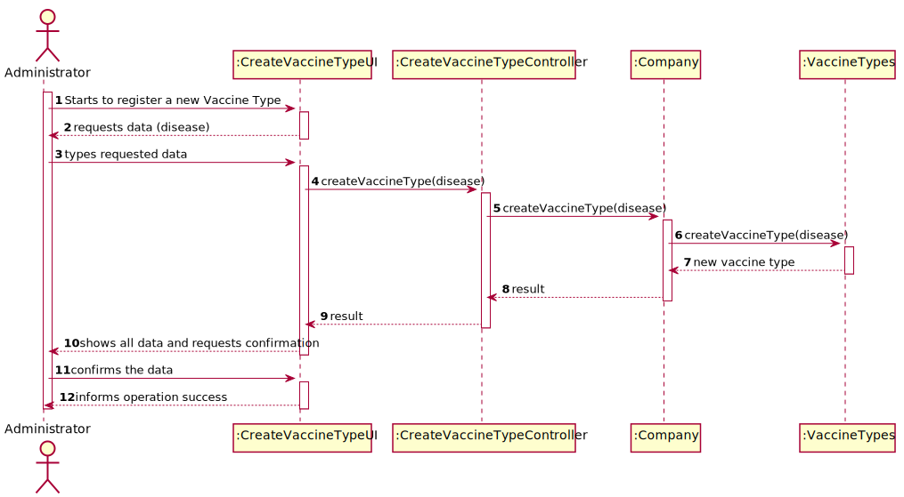
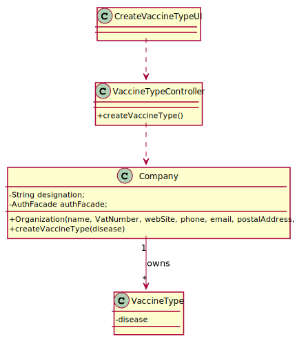

# US 012 - Specify new vaccine type

## 1. Requirements Engineering

### 1.1. User Story Description

As an administrator, I intend to specify a new vaccine type.

### 1.2. Customer Specifications and Clarifications

n/a

### 1.3. Acceptance Criteria
n/a

### 1.4. Found out Dependencies

n/a

### 1.5 Input and Output Data

**Input Data:**

* Typed data:
    * a disease
    

**Output Data:**

* Vaccine Type
* In(success) of Operation

### 1.6. System Sequence Diagram (SSD)

**Alternative 1**

**Other alternatives might exist.**

### 1.7 Other Relevant Remarks

* The vaccine type is after showed registered

## 2. OO Analysis

### 2.1. Relevant Domain Model Excerpt 

### 2.2. Other Remarks

n/a

## 3. Design - User Story Realization 

### 3.1. Rationale

**SSD - Alternative 1 is adopted.**

| Interaction ID | Question: Which class is responsible for...   | Answer            | Justification (with patterns)                                                                                 |
|:-------------  |:----------------------------------------------|:------------------|:--------------------------------------------------------------------------------------------------------------|
| Step 1  		 | 	... interacting with the actor?              | VaccineUI         | Pure Fabrication: there is no reason to assign this responsibility to any existing class in the Domain Model. |
|			  		 | 	... coordinating the US?                     | VaccineController | Controller                                                                                                    |
| Step 2		  		 | 	... instantiating a new Vaccine Type?        | Company           | Creator (Rule 1): in the DM, Company has vaccine types.                                                       |
| Step 3  		 | 	...saving the inputted data?                 | VaccineType       | IE: object created in step 1 has its own data.                                                                |								 |             |                              |              
| Step 4 		 | 	... validating all data (local validation)?  | VaccineType       | IE: owns its data.                                                                                            | 
| 			  		 | 	... validating all data (global validation)? | Company           | IE: knows all its vaccine types.                                                                              | 
| 			  		 | 	... saving the created vaccine types?        | Company           | IE: owns all its vaccine types.                                                                                       | 
|Step 5		 | 	... informing operation success?             | VaccineUI         | IE: is responsible for user interactions.                                                                     | 

### Systematization ##

## 3.2. Sequence Diagram (SD)

**Alternative 1**

## 3.3. Class Diagram (CD)

**From alternative 1**

# 4. Tests 

*It is also recommended to organize this content by subsections.* 

# 5. Construction (Implementation)

## Class VaccineController 

## Class Organization

# 6. Integration and Demo 

# 7. Observations

