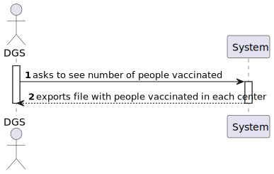
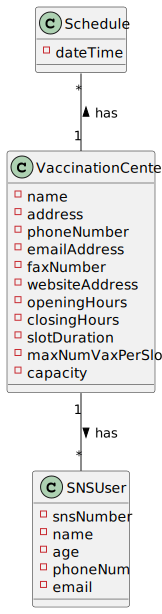
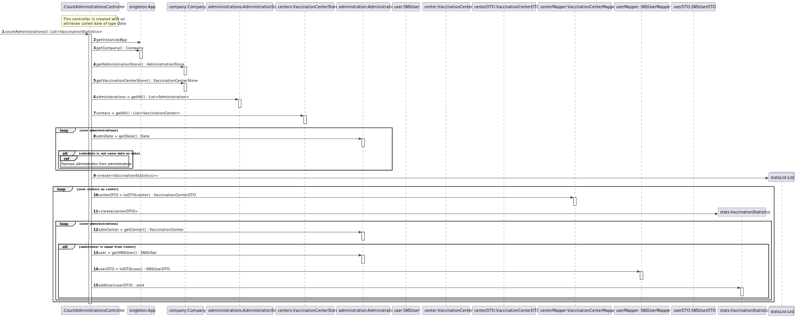
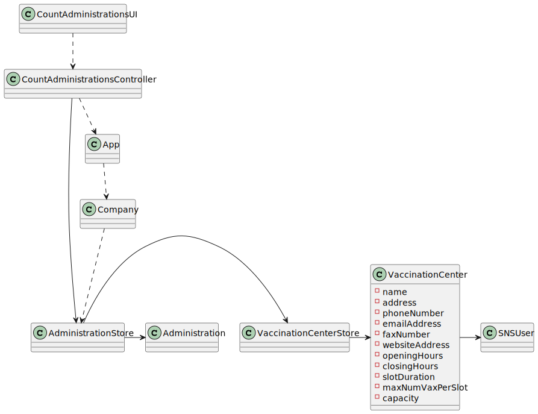

# US6: DGS wants to record daily the total number of people vaccinated in each vaccination center

## 1. Requirements Engineering
### 1.1. User Story Description

DGS wants to record daily the total number of people vaccinated in each vaccination center

### 1.2. Customer Specifications and Clarifications

*From the specifications document:*
> No duplicate entries should be possible for the same SNS user on the same day or vaccine period.

*From the client clarifications:*
> *Question:* Dear client, In the acceptance criteria, "the algorithm should run automatically at a time defined in a configuration file and should register a date, the name of the vaccination center and the total number of vaccinated users." How it is supposed to register this information? Should it be recorded in a file (ex: txt,..) or recorded in the system (ex: in a store) ?
>
> *Answer:* The data should be written to a CSV file (field delimiter should be a semicolon).

### 1.3. Acceptance Criteria

* *AC:* The algorithm should run automatically at a time defined in a configuration file and should register the date, the name of the vaccination center and the total number of vaccinated users.

### 1.4. Found out Dependencies

* No found dependencies

### 1.5 Input and Output Data

**Input Data:**

* Typed data:
    * Asks to see number of people vaccinated

* Output Data:
  * File with the number of people per day that were vaccinated in each center

### 1.6. System Sequence Diagram (SSD)

**Alternative 1**

**Other alternatives might exist.**

### 1.7 Other Relevant Remarks

* SNS User must exist in order to be checked-in

## 2. OO Analysis

### 2.1. Relevant Domain Model Excerpt

### 2.2. Other Remarks

n/a

## 3. Design - User Story Realization

### 3.1. Rationale

**SSD - Alternative 1 is adopted.**

| Interaction ID   | Question: Which class is responsible for...  | Answer                     | Justification (with patterns)       |
|:-----------------|:---------------------------------------------|:---------------------------|:------------------------------------|
| Step 1  	        | ... starts counting  a Vaccination?          | ReceptionistUI             | Receptionist inserts data from user |
| Step 4           | ... validating all data (local validation)?  | ReceptionistUI             | IE: owns its data.                  |	
| Step 5           | ... enters required data?                    | ReceptionistUI             |      IE: owns its data.          |
| Step 14          | ... Shows the Data and requests confirmation | ReceptionistUI             |     IE: owns its data.               | 
| Step 15          | ... Confirms Data                            | ReceptionistUI             |        IE: knows everything about SNSUsers.     |
| Step 20          | ... informing operation success?             | ReceptionistUI             |   IE: is responsible for user interactions.     |

### Systematization ##
## 3.2. Sequence Diagram (SD)

**Alternative 1**

## 3.3. Class Diagram (CD)

**From alternative 1**

# 4. Tests

# 5. Construction (Implementation)

## Class numberOfPeopleVaccinatedController

    public boolean saveNumberOfPeopleVaccinatedPerCenter(numberOfPeopleVaccinated nopv){
        return this.nopvList.add(nopv);
    }

    public List<numberOfPeopleVaccinated> getNumberOfPeopleVaccinatedPerCenter(){
        return new ArrayList<>(this.nopvList);
    }

    public boolean sendDataToCSV() {
        try {
            FileWriter fWriter = new FileWriter("NumberOfPeopleVaccinated.csv", true);
            BufferedWriter bw = new BufferedWriter(fWriter);
            PrintWriter out = new PrintWriter(bw);

            String pattern = "dd/MM/yyyy";
            DateFormat dateFormat = new SimpleDateFormat(pattern);

            for(numberOfPeopleVaccinated nopv : nopvList) {
                out.printf("%s, %s, %d\n", dateFormat.format(nopv.getDate()), nopv.getVacCenterName(), nopv.getNVaccinations());
            }

            out.flush();
            out.close();
            return true;
        } catch (Exception e) {
            System.out.println(e);
        }
        return false;
    }

# 6. Integration and Demo
* There is a nem SD added to the program, which is a requirement for the US, that is the timer.

# 7. Observations
None.

